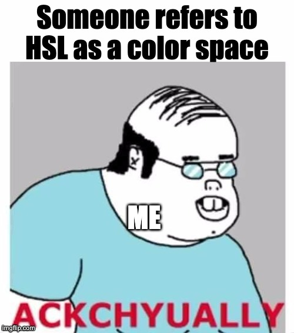

I was having a rough time recently trying to understand how the [new CSS color functions](https://developer.mozilla.org/en-US/blog/css-color-module-level-4/) work and why they are better than what we had before. I've been using colors in CSS for a decade, but besides knowing what the three letters in RGB stood for, I knew nothing about color theory.


This article assumes that you have at least heard about the new CSS color features. Its goal is to clear up the most common terms in the topic, it is not meant to be a deep dive by any means – it is probably not even entirely accurate – but thinking about them this way helped me make sense of all the new color features.

## Color space

A color space is a **range of colors**, like the [range of colors visible to the human eye](https://en.wikipedia.org/wiki/CIE_1931_color_space). Historically in CSS we could only define colors in the sRGB space, which is roughly one third of the visible color spectrum.^[[https://en.wikipedia.org/wiki/SRGB#/media/File:SRGB_chromaticity_CIE1931.svg](https://en.wikipedia.org/wiki/SRGB#/media/File:SRGB_chromaticity_CIE1931.svg)] Modern displays are capable of showing way more colors than that. We will call the colors that fall into this wider range, high definition colors.

The CSS Color Level 4 spec introduced several [new color spaces](https://developer.mozilla.org/en-US/docs/Web/CSS/color_value/color#colorspace) that we can utilize with the new functions. These are already supported in most browsers^[[https://caniuse.com/?search=color%20function](https://caniuse.com/?search=color%20function)], so you can start making your websites more colorful.

## Color model

A color model is a **mathematical model for expressing colors**. Think of them as functions, that take some parameters and return a color. For example in CSS the `rgb()` and `hsl()` color functions are based on models with the same names. 

Although technically incorrect, it is common to refer to models as color spaces^[[https://developer.chrome.com/docs/css-ui/high-definition-css-color-guide](https://developer.chrome.com/docs/css-ui/high-definition-css-color-guide)], which confused the hell out of me initially. The reason for this is that in practice, models are accompanied with a mapping function which maps the values of the model to a color in a color space. This means that a particular combination of model and mapping function will identify a color space.



Choosing what model to use is not just about preference. Let's say I want the background color of a button to be slightly lighter when it is hovered. If the original color is defined as a hex value, I would probably reach for a color picker to get the lighter version. With the introduction of `hsl()` into CSS, manipulating color got a lot simpler. It makes more sense what changing each value will do to the color. With `hsl()`, getting the lighter color is just a matter of increasing the value of the third (lightness) parameter, I don't even have to leave my editor.

The Color Level 4 spec introduced a bunch of [new color functions](https://developer.mozilla.org/en-US/blog/css-color-module-level-4/#new_functional_notation_for_colors), that – besides giving us a broader range of colors to choose from – have further improved the way we work with colors.

## Gamut

A gamut – just like a color space – is a **range of colors**. The difference is that gamut refers to the colors that **a device** (eg. a monitor or printer) **can display or reproduce within a color space**.

With the new color spaces in CSS we can take advantage of wide gamut displays. While browsers are smart enough to approximate high definition colors on non-HD devices, providing a fallback ourselves can yield better results. Just like with other device characteristics, we will use a media query to check if the user's display supports a specific gamut.

```css
p {
  background-color: red; /* fallback color */
  
  /* check if the user's browser supports oklch() */
  @supports (background-color: oklch(0 0 0)) {
    /* check if the display supports the p3 gamut */
    @media (color-gamut: p3) {
      background-color: oklch(45% 0.3 264);
    }
  }
}
```

To know what gamut to test for, given a certain color, you can use a color picker that provides this information (eg. [oklch.com](https://oklch.com)) or use the [stylelint-gamut](https://github.com/fpetrakov/stylelint-gamut) Stylelint plugin.

## Summary

My goal with this post was to summarize the things that have helped me understand the CSS Color Level 4 spec. Having a basic understanding of these three terms should be enough to be able to comfortably use the new color functions.

If you wish to learn more about the new CSS features, I've listed some great articles below.

## Further reading

- [https://developer.mozilla.org/en-US/blog/css-color-module-level-4/](https://developer.mozilla.org/en-US/blog/css-color-module-level-4/) – An introduction to the spec by MDN.
- [https://developer.chrome.com/docs/css-ui/high-definition-css-color-guide](https://developer.chrome.com/docs/css-ui/high-definition-css-color-guide) – Lengthy article about the new features by Adam Argyle. Also goes into some color theory.
- [https://evilmartians.com/chronicles/oklch-in-css-why-quit-rgb-hsl](https://evilmartians.com/chronicles/oklch-in-css-why-quit-rgb-hsl) – Why the folks at Evil Martians moved to `oklch()`.