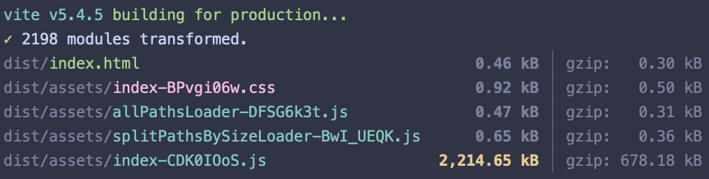
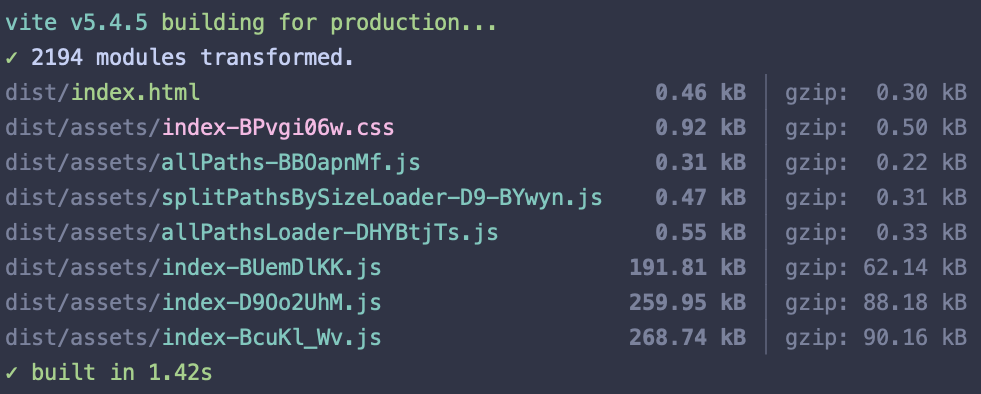

---
tags:
  - blog
timestamp: 2024-09-18T18:40:13.777Z
title: How I halved the bundle size of our React applications
layout: layouts/post.webc
permalink: /blog/how-i-halved-the-bundle-size-of-our-react-applications/
draft: true
---
Single page application frameworks get a lot of (well deserved) flak for producing enormous JavaScript bundles. Although some of this bloat cannot be avoided, it is worth taking a closer look at your setup, because a misconfigured toolchain can add KBs or even MBs to your app's final size.

In this post I explain how I shaved off almost half the size of some of our applications by changing how our internal NPM libraries are built.

## Initial setup

For the purpose of showing the issue I've created a stripped-down version of our app. It is a monorepo setup of a [Vite](https://vite.dev) based React application and a component library, both written in TypeScript. The library package uses an open-source general purpose component library called [BlueprintJS](https://blueprintjs.com/).

The example app renders a single BlueprintJS button imported from the component library.

```jsx
// app/src/App.tsx
import { MyButton } from 'lib';

function App() {
  return (
    <MyButton />
  );
}

export default App;

// lib/index.tsx
import { Button } from '@blueprintjs/core';
import { IconNames } from '@blueprintjs/icons';

export function MyButton() {
  return (
    <Button
      rightIcon={IconNames.COG}
    />
  );
}
```

Simple enough, right? The app bundle shouldn't be more than a few kilobytes. Let's do a prod build!



HOLY CANNOLI! How did THAT happen?! That bundle is so fat, it has its own ZIP code. Let's take a look inside the bundle and see what we can find out. We can use [vite-bundle-visualizer](https://www.npmjs.com/package/vite-bundle-visualizer) for that.

")

Looks like the entire BlueprintJS library has been included into our bundle. To understand how this happened we need to take a closer look at our component library and learn a bit about how bundlers work.

Before we got ES modules, JavaScript had several non-standard module systems. Historically npm packages used a module system called CommonJS, since that was the default for NodeJS. By design CommonJS is dynamic, which makes it hard to statically analyze. The problem with this is that bundlers analyze your modules so that in the final bundle only the code that you actually use is included. This process is called tree-shaking. Nowadays most npm packages are provided as both ES and CommonJS modules as well. This is true for BlueprintJS as well. So how come we ended up with Godzilla in our build folder?

Before being imported into our app, the component library is run through the TypeScript compiler. Let's take a look at the compiler's output.

```js
"use strict";
Object.defineProperty(exports, "__esModule", { value: true });
exports.MyButton = MyButton;
const jsx_runtime_1 = require("react/jsx-runtime");
const core_1 = require("@blueprintjs/core");
const icons_1 = require("@blueprintjs/icons");
function MyButton() {
    return ((0, jsx_runtime_1.jsx)(core_1.Button, { rightIcon: icons_1.IconNames.COG }));
}
```

Those `require()` calls are a clear sign that 
this code is using CommonJS. So even if our app uses ES modules, we will end up with the CommonJS variant of BlueprintJS because of how our component library is built.

Let's fix this!
## The fix

Thankfully we don't have to do much to tell the TypeScript compiler what module system to use.

```diff
// tsconfig.json
{
...
-  "module": "commonjs",
+  "module": "esnext",
+  "moduleResolution": "bundler",
...
}
```

First we set `module` to `esnext` to tell TypeScript that the compiled code should use ES modules. When using this option we are also required to set the `moduleResolution` option to tell TypeScript how it should resolve imports. If your code will be bundled – like in our case – the recommended value to use is `bundler`.

As I mentioned above, it is possible for a library to provide both ES and CommonJS modules, but I will not be getting into that in this article. If you would like to learn more about creating npm packages, I suggest you take a look at this [wonderful article by Matt Pocock](https://www.totaltypescript.com/how-to-create-an-npm-package).
## Results

Now that our tsconfig is updated, let's do another build and see how our output changes.

```js
import { jsx as _jsx } from "react/jsx-runtime";
import { Button } from "@blueprintjs/core";
import { IconNames } from "@blueprintjs/icons";
export function MyButton() {
    return (_jsx(Button, { rightIcon: IconNames.COG }));
}
```

This time the compiled code is almost identical to our original source code, it is no longer using CommonJS. Only the jsx parts have been transpiled.

Let's see how this change affects our application bundle.



This looks much better. Our bundle is now split into three much smaller JavaScript files. The code-splitting occured because the ES module variant of BlueprintJS utilizes dynamic imports, which if encountered by Vite will cause a split.
## Takeaways 

Although this article focuses on a specific issue and its solution, my main takeaways are more general. First of all the bundle should not be treated as a black box, you can and should take a look inside to spot potential issues. And most importantly, you should familiarize yourself with the tools you use in order to make the best possible version of your app.

You can find the source code of the example here: [https://github.com/spiroka/bundle-size-demo](https://github.com/spiroka/bundle-size-demo).